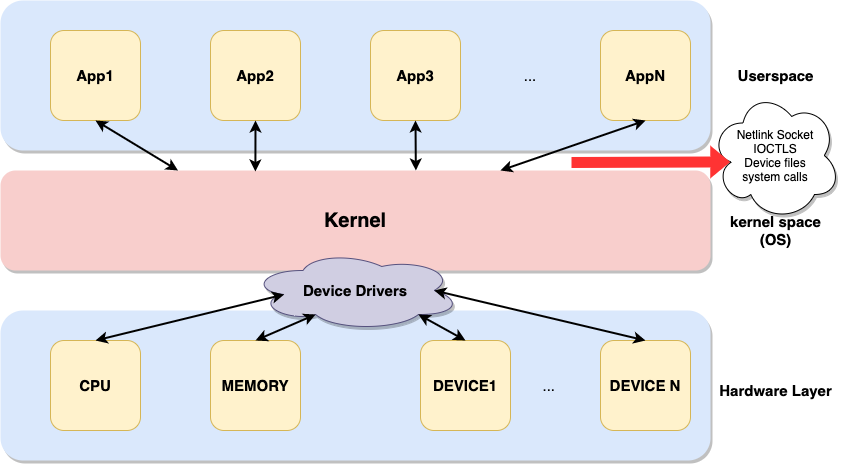
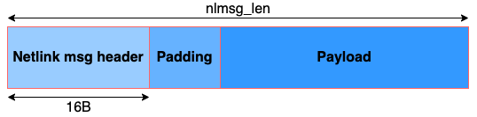
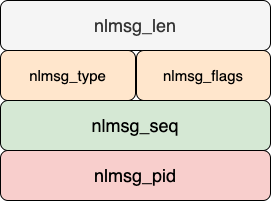

# Conecpts behind netlink sockets

Netlink socket is a kernel feature which is provided in the linux kernel and it is a feature which is used for IPC between Userspace and Kernel space.
Kernel modules are pieces of codes that can be loaded and unloaded into the kernel upon demand. 


They extend the funcitonality of the kernel without the need to reboot the system or recompiling the linux kernel.
```
* Load the kernel module: sudo insmod <lkm.ko>
* unload lkm: rmmod <lkm>
* check loaded lkm: lsmod
```

How to write a kernel module ? first and foremost, we need to add a proper header file into our code base.
```
#include <linux/module.h>
```

Each module must have initiator and cleanup functions. The initiator must be invoked when the module is called and the cleanup is called also when the module is being removed.
there are two main functions for declaring initiator and cleanup:
```
module_init()
module_exit()
```

If we don't use the init and cleanup modules, the kernel calles default init and cleanup functions.
Also, it is important to mention the auther and description of the module according to below format:

```
MODULE_AUTHOR(author_name);
MODULE_DESCRIPTION(module_desc);
```

The format for writing Makefile is as below:
```
obj-m += helloworldLKM.o
all:
	make -C /lib/modules/`uname -r` /build M=$(PWD) modules
clean:
	make -C /lib/modules/`uname -r` /build M=$(PWD) clean
```
To instantly monitor kernel module behavior, simply run below command:
```
tail -f /var/log/kern.log
```

# Netlink
According to below picture, accessing to hardware resources is via linux modules or device drivers. And
also userspace applications can indirectly access to hardware resources via kernel. There are 4 means of communicating
with linux kernel: 
1. Netlink socket
2. IOCTLS
3. Device files
4. system calls



A socket based technique for communicating between userspace and kernel space was developed to build the **unified interface**
using which userspace applications can interact with **various kernel subsystems**. Any communication messages between two parties
must follow pre-defined message format. The format for Netlink messages is as below:



and the header file must contain a data structure as below:
```
struct nlmsghdr{
    u32 nlmsg_len;
    u16 nlmsg_type;
    u16 nlmsg_flags;
    u32 nlmsg_seq;
    u32 nlmsg_pid;
};
```
According to below picture, there are five field in the netlink socket header which they are being elaborated in 
detail:



* As said before, **nlmsg_len** represents the total length of netlink message including the payload.
* The second type is **nlmsg_type**. There are 4 standard types defined in ```/usr/include/linux/netlink.h```.
```asm
#define NLMSG_NOOP  0x1
#define NLMSG_ERROR 0x2
#define NLMSG_DONE 0x3
#define NLMSG_OVERRUN 0x4
```
NLMSG_NOOP: When the other party receives this message, it does nothing except it replies with NLMSG_DONE telling the sender
that all is fine.

NLMSG_ERROR: When the other party receives this message as a reply to the message sent previously, it means that other party
failed to perform requested action (negative feedback)

NLMSG_DONE: This is the last Netlink message in the cascade of multiple Netlink message units.

NLMSG_OVERRUN: Currently not used in linux kernel anywhere.

Besides above, User can define his own message types which should be greater than 16

* The third item is **nlmsg_flags**. These flags are set in Netlink message to convey additional information to the recipient.
It is worth mentioning that multiple flags could be set using bitwise ADN/OR operators. These flags also cen be found in the same
  header as before.